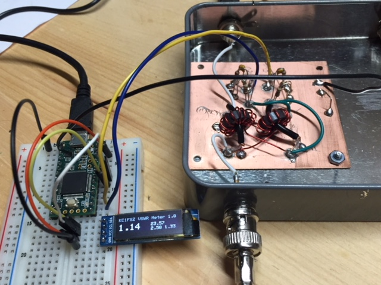

# KC1FSZ Return Loss/VSWR Meter

Uses a 128x32 OLED driven by the standard SSD1306 chip.

Connect the forward voltage sample to the A0 analog input and the reverse
voltage sample to the A1 analog input.

There are four number shown on the display:

# VSWR
# Return loss (dB)
# Forward power (watts)
# Voltage of forward power sensor (volts)

